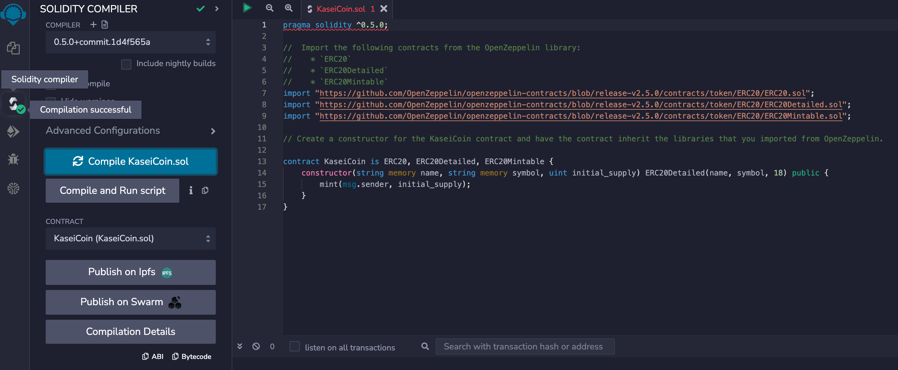
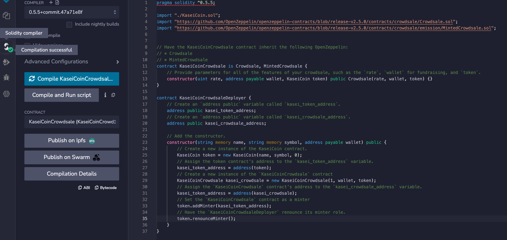

## Module 21 Challenge : Define a new cryptocurrency called KaseiCoin
Submission for Bryan Tran Lu. 

## Technology Requirements
* Remix

* Ganache

* MetaMask

## Instructions
The KaseiCoin Token contract is in file is in `KaseiCoin.sol`.

The KaseiCoin Deployer and Crowdsale contracts are in `KaseiCoinCrowdsale.sol`.

1) Open the Solidity file in the Remix IDE.

2) Compile and deploy the Deployer contact to a local blockchain.

3) Copy the addresses for the Token and Crowdsale contracts and paste them in their respective "At Address" fields.

4) The contract functions will now be available to use.

## Screenshots
* Create the KaseiCoin Token Contract - Take a screenshot of the successful compilation of the contract.

* Create the KaseiCoin Deployer Contract - Take a screenshot of the successful compilation of the contract.

## Authors and Support
If there are any questions regarding the assignment, please reach out via email.
